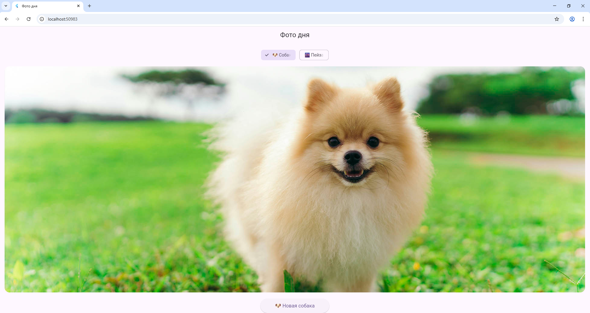

# Лабораторная работа №5. Асинхронность в Dart и Flutter. Создание приложения «Фото дня».
Приложение на Flutter, которое загружает случайные фотографии собак или пейзажей из открытых API (или из локальных ресурсов).  Демонстрирует работу с асинхронностью в Dart: `Future`, `async/await`, загрузку данных по HTTP и индикацию загрузки.

### Информация об авторе
**Студенты:** Зламанюк А.А.; Телятникова Е.П.

**Группа:** ИСП-231

### Стек и версии
* Flutter: версия 3.41.1
* Dart: версия 3.11.0
* Платформа: Web (Chrome)
* Пакеты: http

### Скриншот приложения


### Как запустить
1. Клонируйте репозиторий:
   ```bash
   git clone https://github.com/AnastasiaZlamanyuk/Flutter_Lab5.1.git
   cd Flutter_Lab5.1
   ```
2. Установите зависимости:
   ```bash
   flutter pub get
   ```
3. Подключите устройство или эмулятор, либо используйте Chrome:
   ```bash
   flutter run -d chrome
   ```
4. Дождитесь сборки и наслаждайтесь приложением.

### Что изучили?
* Модели данных в Flutter и Dart
* Асинхронное программирование с использованием Future и async/await
* Построение списков с помощью ListView.builder
* Управление состоянием через setState
* Работа с виджетами Card и Image

### Ответы на вопросы:
1. **Future<T>** — это объект, представляющий результат асинхронной операции, который может быть получен в будущем. Отличается от обычного возвращаемого значения тем, что:
   * Возвращает результат не сразу
   * Может быть обработан через then() или await
   * Представляет асинхронную операцию
2. **await** приостанавливает выполнение только текущей асинхронной функции, не блокируя весь поток выполнения приложения. Это позволяет другим частям приложения продолжать работу.
3. **setState()** вызывается дважды в _fetchPhoto() из-за особенностей работы Flutter:
   * Первый вызов — для обновления состояния во время загрузки
   * Второй — после получения данных
4. Кнопке передаётся _fetchPhoto без скобок, потому что:
   * Нужно передать ссылку на функцию
   * Скобки вызвали бы немедленный вызов функции
   * Без скобок функция будет вызвана при нажатии
5. **Image.network()** и **Image.asset()** отличаются источником изображения:
   * Image.network() — загружает изображение из интернета по URL
   * Image.asset() — берёт изображение из локальных ресурсов приложения